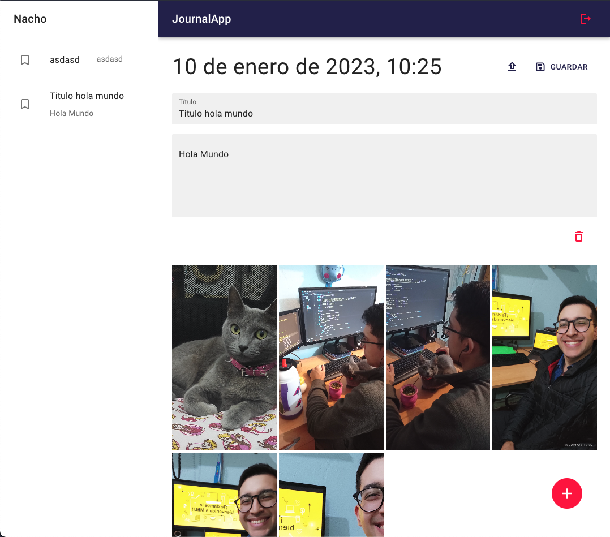

# Journal App

## Proyecto de Práctica, curso de React de Fernando Herrera.

Además de **React** con **Vite**, se usan tecnologías como **Redux Toolkit** con sus respectivos Thunks, **Firebase** para la DB en su versión 9 (modular), **Cloudinary** para la subida de imágenes y **Material UI** para la vista.

El proyecto no está desplegado en gh-pages por tema de variables de entorno y demás. Pero de todas maneras les dejo un ejemplo de cómo se ve funcionando:

Si quieren probarlo, pueden agregar las variables de entorno creadas en el archivo `.env.template`. Para esto tienen que crear un proyecto en **Firebase**, copian sus apiKeys y las pegan. Lo mismo para **Cloudinary**.